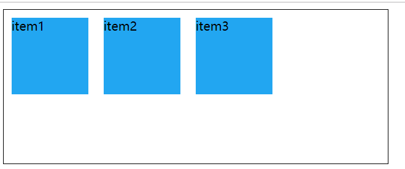
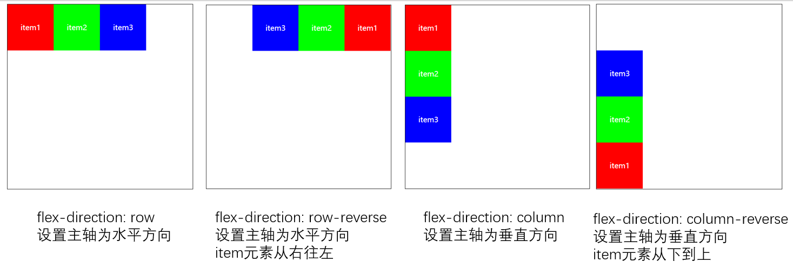
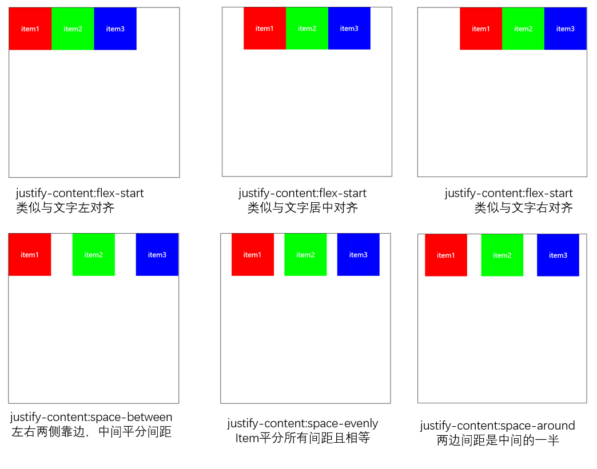
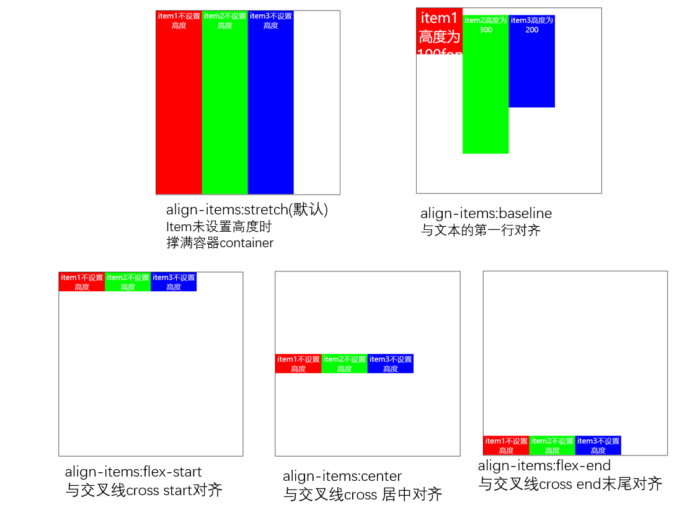

## 案列演示


``` html
<style>
.container{
    width: 500px;
    height: 200px;
    /* 父元素container设置display开启flex布局 */
    display: flex;
    border: 1px solid #000;
}
.item{
    /* 子元素container设置width、height、color等具体样式 */
    width: 100px;
    height: 100px;
    background: #22A6F1;
}
</style>

<body>
    <div class="container">
        <div class="item">item1</div>
        <div class="item">item2</div>
        <div class="item">item3</div>
    </div>
</body>
```


## 一、container和item
- 开启flex布局的父元素叫**flex container**
- 在容器下的子元素叫**flex item**
- container设置`display:flex / inline-flex`开启flex布局，设置inline-flex时父元素container以inline行内元素存在
- container用来控制子元素item位置排列方式


## 二、主轴main axis和交叉轴cross axis

主轴和交叉轴既可以是水平方向也是可以是垂直方向的，但总是互相垂直
`flex-direction : row`设置主轴main为水平方向
`flex-direction : column`设置主轴main为垂直方向


## 三、container和item上的相关属性


- 应用在flex container上的css属性

    - flex-direction ：设置主轴方向为水平/垂直
    - justify-content ：设置item在主轴main上的对齐方式
    - aligh-items ：设置item在交叉轴cross上的对齐方式
    - flex-wrap ：设置items的多行显示
    - flex-flow ：flex-wrap和flex-direction的组合缩写属性
    - align-content ：设置行与行之间在交叉上的对齐方式，只用在多行显示

- 应用在子元素flex item上的css属性
    - order ：决定item的排列顺序
    - align-self ：决定单个item在交叉轴的对齐方式，会覆盖align-items
    - flex-grow ：决定item的扩展规律
    - flex-shrink ：决定item的收缩规律
    - flex-basis  ：设置item在主轴上的大小，优先级低于 max/min-width/height 
    - flex ：复合属性 flex-grow || flex-shrink || flex-basis

    虽然属性很多但是在实际开发中一般不会全部使用。只需要挑几个需要的或者使用频率高的属性即可

## 排列方式

### 1. flex-direction
 改变主轴方向为：水平row(默认) 或者 垂直column
- row
- row-reverse
- column
- column-reverse

``` html
<style>
.container{
    /* 改变主轴方向 */
    display: flex;
    flex-direction: row;
    flex-direction: row-reverse;
    flex-direction: column;
    flex-direction: column-reverse;
}
</style>

```



### 2. justify-content
改变item元素在主轴main(水平)上的对齐方式
- flex-start
- flex-center
- flex-end
- space-between
- space-evently
- space-around

``` html
<style>
.container{
    display: flex;
    /* 改变item在主轴上的对齐方式 */
    justify-content: flex-start;
    justify-content: flex-end;
    justify-content: center;
    justify-content: space-between;
    justify-content: space-evenly;
    justify-content: space-around;
}
</style>

```




### 3. align-items
改变item元素在在交叉轴cross(垂直)上的对齐方式
- stretch
- baseline
- flex-start
- center
- flex-end

``` html
<style>
.container{
    display: flex;
    flex-direction: row;
    justify-content: flex-start;

    /* 改变item在交叉轴(垂直)cross的对齐方式 */
    align-items: stretch;
    align-items: flex-start;
    align-items: center;
    align-items: flex-end;
    align-items: baseline;
    
}
.item{
    width: 100px;
    /* 不设置item高度 */
    /* height: 100px; */
    color: #fff;
    text-align: center;
}
</style>


```



