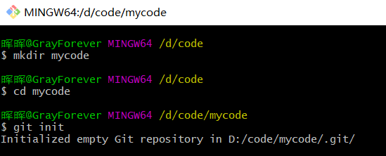
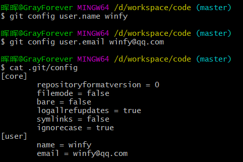
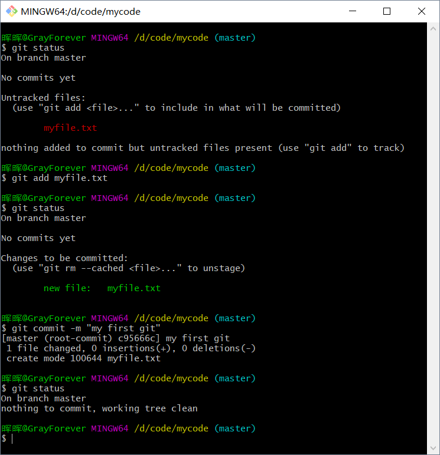
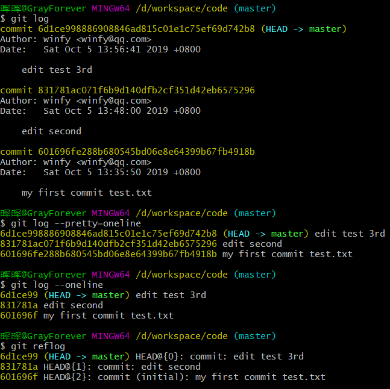

##  安装Git
  
1. 进入Git官网<https://git-scm.com/downloads>，根据自己的系统选择对应的版本
2. 运行安装程序，选择安装目录时注意不要带空格和中文
3. 通常情况按默认状态安装即可，在`Select Components`时注意勾选**Git Bash Here**即可
##  1. 进入git命令行
  
1. 在你的电脑选择或者创建一个本地文件夹，在本地文件目录下右键 git bash here，
2. `mkdir` 可以新建文件夹名
3. `cd 文件路径` 进入新建后的文件目录

  
  
##  2. git init 初始化本地仓库
  
1. `git init` 
在当前文件目录下输入`git init`初始化厂库，生成.git文件
  
##  3. 设置签名
  
1. 格式
>用户名：winfy
    email：winfy@qq.com
2. 仓库级别 
    - `git config user.name winfy`
    - `git config user.email winfy@qq.com`
3. 系统级别 
    - `git config --global user.name winfy_glb`
    - `git config --global user.email winfy_glb@qq.com`
4. 仓库级别优先于系统级别。如果只要系统级别的签名，就以系统级别签名为准
5. 查看仓库级别签名 `cat .git/config`
6. 查看系统级别签名 
    - `cd ~`
    - `pwd`
    - `cat .gitconfig`
    - `或者cat ~/.gitconfig`

  
  
##  4. 查看本地仓库状态，添加提交文件
  
    当本地目录下的文件发生变化时，git仓库会记录当前状态但是不会更新，可以通过git status查看文件的变化状态
    每次操作后都可以使用git status查看状态
    git add将更改后的文件添加到暂存区
    git commit则将暂存区的文件更新到本地仓库
1. 查看仓库状态
    - `git status` 
2. 添加操作
    - `git add [文件名]` 
3. 提交操作
    - `git commit -m "修改信息" [文件名]`
  

  
##  5. 查看历史记录
  
- `git log` 完整显示历史信息
    多屏显示控制方式
        - 空格 向下翻页
        - b 向上翻页
        - q 退出
- `git log --pretty=oneline` 简介显示
- `git log --oneline` 简介显示，缩短hash值
- `git reflog` HEAD@{显示到其他版本需要的步数}

  
##  6. 前进后退版本
  
1. 基于索引值操作
    - `git reset --hard [索引值]`
2. 使用^符号 只能后退
    - `git reset --hard HEAD^`
        一个^表示后退一步
3. 使用~符号 只能后退
    - `git reset --hard HEAD~n`
          表示后退n步
##  7. 创建远程库
  
1. github
    1. 复制仓库地址：`https://github.com/winfyho/winfy.git`
    2. 创建远程地址别名github(别名可以自定义)
        - `git remote add github [https://github.com/winfyho/winfy.git]`
2. 码云
    1. 复制仓库地址：`https://gitee.com/winfyho/winfy.git`
    2. 创建远程地址别名gitee
    `git remote add gitee [仓库地址]`
##  8. 推送远程库操作
  
1. 在本地需要推送的目录下输入 `git push github [分支名master]`
2. 然后输入远程库账号密码

  
##  9.克隆
  
1. 在本地仓库目录下 `git clone [远程仓库地址]`
    克隆无须git init,系统会自动初始化本地库
  
  